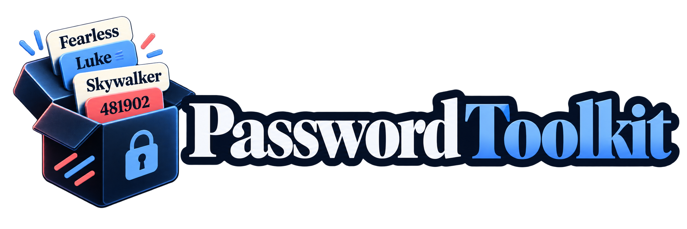

<p align="center">
    
</p>

# PasswordToolkit

Memorable, human-friendly passwords for Laravel — `Goldrake-Mitico-4271` in Italian, `Fearless-Luke-Skywalker-3301` in English — built from 91 curated dictionaries, in the language you choose, with dictionaries of your own alongside them.

[](https://packagist.org/packages/gabrielesbaiz/password-toolkit)
[](composer.json)
[](https://packagist.org/packages/gabrielesbaiz/password-toolkit)
[](LICENSE.md)
[](https://github.com/sponsors/gabrielesbaiz)

> [!CAUTION]
> **Upgrading from 1.x?** Read [UPGRADE.md](UPGRADE.md) first. `generate($count)`
> is now `generateMany($count)`, `generate()` throws instead of returning
> `null`, and the config block changed. Most of it is shimmed; four things are
> not.

> [!IMPORTANT]
> **Does this save you time?**
> A ⭐ costs you nothing and helps other developers find it.
> [Sponsoring](https://github.com/sponsors/gabrielesbaiz) keeps it compatible
> with every new Laravel release.

---

## Contents

- [Do you need this?](#do-you-need-this)
- [Requirements](#requirements)
- [Installation](#installation)
- [Quick start](#quick-start)
- [Configuration](#configuration)
  - [Dictionaries](#dictionaries-1)
  - [Locale](#locale)
  - [Separator and word breaks](#separator-and-word-breaks)
  - [Word order](#word-order)
  - [Numbers](#numbers)
  - [Leetspeak](#leetspeak)
  - [Strength](#strength)
- [Dictionaries](#dictionaries)
  - [Built-in](#built-in)
  - [Groups, tags and reach](#groups-tags-and-reach)
  - [Building a picker](#building-a-picker)
  - [Your own dictionaries](#your-own-dictionaries)
  - [Locales and adjectives](#locales-and-adjectives)
  - [Translated names](#translated-names)
- [The builder](#the-builder)
- [Strength reporting](#strength-reporting)
  - [The two models](#the-two-models)
  - [Score thresholds](#score-thresholds)
- [Validation](#validation)
- [Commands](#commands)
- [Recipes](#recipes)
- [Troubleshooting](#troubleshooting)
- [Security](#security)
  - [Reporting a vulnerability](#reporting-a-vulnerability)
- [Testing](#testing)
- [Credits](#credits)
- [Support this package](#support-this-package)
- [Disclaimer](#disclaimer)
- [License](#license)

## Do you need this?

If you need a secret for a machine — an API key, a token, a root credential —
**you do not need this package**. Use what Laravel already gives you:

```php
Str::password(32);   // or random_bytes(32)
```

That is higher entropy, shorter, and nobody has to read it aloud.

You want this package when a **human** is in the loop: when someone has to
dictate the password over the phone, type it off a printed sheet, or remember it
until they change it. `Goldrake-Mitico-4271` survives that. `xK#9$!qZ` does not.

The realistic uses are user onboarding, initial credentials, demo and staging
accounts, share links, and seeded fixtures. Every one of those trades entropy
for a human being not getting it wrong — and this package will tell you exactly
how much entropy you traded.

## Requirements

- PHP 8.2 or newer
- Laravel 10, 11, 12 or 13

## Installation

```bash
composer require gabrielesbaiz/password-toolkit
```

Publish the config if you want to change anything:

```bash
php artisan vendor:publish --tag="password-toolkit-config"
```

The defaults generate working passwords with no configuration at all.

## Quick start

```php
use Gabrielesbaiz\PasswordToolkit\Facades\PasswordToolkit;

PasswordToolkit::generate();
// "Goldrake-Mitico-4271"

PasswordToolkit::generateMany(10);
// ["Goldrake-Mitico-4271", "Vespa-Veloce-9921", …] — exactly 10

PasswordToolkit::generateUnique(10);
// the same, with no repeats

PasswordToolkit::generateWithReport();
// ['password' => "Goldrake-Mitico-4271", 'report' => StrengthReport]
```

Or override anything for a single call, without touching your config:

```php
PasswordToolkit::make()
    ->locale('en')
    ->only(['star_wars', 'italian_wines'])
    ->digits(6)
    ->generate();
// "Fearless-Luke-Skywalker-481902" — English leads with the adjective
```

Inject it instead of using the facade, if you prefer:

```php
use Gabrielesbaiz\PasswordToolkit\Contracts\PasswordGenerator;

public function __construct(private readonly PasswordGenerator $passwords) {}
```

## Configuration

Everything lives in `config/password-toolkit.php`.

### Dictionaries

```php
'dictionaries' => [
    'enabled' => '*',                    // '*', or ['star_wars', 'italian_wines']
    'except'  => [],                     // applied after 'enabled'
    'types'   => ['people', 'things'],   // limit to one kind
    'paths'   => [],                     // directories of your own JSON files
    'custom'  => [],                     // dictionaries defined inline
],
```

`php artisan password-toolkit:generate --list` shows exactly what resolves.

### Locale

```php
'locale'          => null,   // null follows the application locale
'fallback_locale' => 'en',   // used when the locale has no resources of its own
```

### Separator and word breaks

```php
'separator_symbol' => '-',    // any string, or null for none
'name_separator'   => true,   // "Luke-Skywalker" (true) or "LukeSkywalker" (false)
```

### Word order

```php
'adjective_position' => null,   // null follows the locale; 'before' | 'after' overrides
```

Leave it `null`. Word order is a property of the language, not a preference, and
each locale declares its own — see [Locales and adjectives](#locales-and-adjectives).

### Numbers

```php
'add_numbers'      => true,
'numbers_digits'   => 4,
'numbers_position' => 'end',   // start | middle | end
```

Digits are drawn with `random_int()`.

### Leetspeak

```php
'leetspeak_conversion' => 'none',   // none | basic | advanced
```

`basic` substitutes single characters and preserves length. `advanced` adds
multi-character glyphs, which lengthens the password — useful against a strict
minimum-length policy.

> [!NOTE]
> Leetspeak is worth **zero** entropy bits and the strength report says so. It
> is a deterministic transform, so it adds no work for an attacker who knows
> your configuration. Reach for it to satisfy a character-class or length
> policy, not to make a password stronger.

| char | basic | advanced |
|---|---|---|
| a | `4` | `4` |
| e | `3` | `3` |
| i / l | `1` | `1` |
| o | `0` | `0` |
| s | `$` | `$` |
| c | — | `<` |
| m | — | `\|V\|` |
| n | — | `\|\\\|` |
| w | — | `\\/\\/` |

### Strength

```php
'strength' => [
    'guesses_per_second' => 1e10,   // one offline GPU against a fast hash
],
```

Raise it towards `1e12` if your threat model includes a well-funded adversary.

## Dictionaries

### Built-in

137 dictionaries — **95 of people** and **42 of things** — holding
2,647 names and 1,019 names respectively, each with themed adjectives in both
Italian and English.

Every one carries a **group**, free-form **tags**, an **icon** and a **reach**.
`Source` is the language its names are written in; anything not in your locale
is translated where a translation exists and left alone where it should be.

<details>
<summary><b>People (95)</b></summary>

| Dictionary | Group | Source | Entries | Example |
|---|---|---|---|---|
| `a_clockwork_orange` | 🍊 screen | en | 13 | Alex DeLarge |
| `alien` | 👽 screen | en | 15 | Ellen Ripley |
| `apocalypse_now` | 🚁 screen | en | 10 | Benjamin Willard |
| `back_to_the_future` | 🚗 screen | en | 17 | Marty McFly |
| `barbie` | 💗 screen | en | 15 | Barbie |
| `blade_runner` | 🌧️ screen | en | 10 | Rick Deckard |
| `cartoons` | 📺 screen | en | 146 | Mickey Mouse |
| `deadpool` | 🗡️ screen | en | 10 | Wade Wilson |
| `die_hard` | 🏢 screen | en | 12 | John McClane |
| `disney_characters` | 🏰 screen | en | 60 | Mickey Mouse |
| `disney_villains` | 😈 screen | en | 20 | Maleficent |
| `django_unchained` | 🤠 screen | en | 10 | Django Freeman |
| `dune` | 🪱 screen | en | 15 | Paul Atreides |
| `encanto` | 🕯️ screen | en | 14 | Mirabel Madrigal |
| `everything_everywhere` | 🥯 screen | en | 12 | Evelyn Wang |
| `game_of_thrones` | 🐉 screen | en | 54 | Jon Snow |
| `ghostbusters` | 👻 screen | en | 13 | Peter Venkman |
| `grease` | 🕺 screen | en | 10 | Danny Zuko |
| `greek_mythology` | 🏺 myth | en | 68 | Zeus |
| `guardians_of_the_galaxy` | 🌌 screen | en | 13 | Peter Quill |
| `harry_potter` | 🧙 screen | en | 71 | Harry Potter |
| `hayao_miyazaki` | 🌸 screen | en | 20 | Totoro |
| `home_alone` | 🏠 screen | en | 14 | Kevin McCallister |
| `inception` | 🌀 screen | en | 10 | Dom Cobb |
| `interstellar` | 🪐 screen | en | 12 | Joseph Cooper |
| `italian_actors` | 🎭 screen | it | 69 | Roberto Benigni |
| `italian_architects` | 📐 arts | it | 43 | Renzo Piano |
| `italian_basketball_legends` | 🏀 sport | it | 71 | Dino Meneghin |
| `italian_chefs` | 👨‍🍳 food | it | 44 | Gualtiero Marchesi |
| `italian_comedians` | 😂 screen | it | 40 | Roberto Benigni |
| `italian_cyclists` | 🚴 sport | it | 50 | Fausto Coppi |
| `italian_dj_producers` | 🎧 arts | it | 20 | Benny Benassi |
| `italian_explorers` | 🧭 history | it | 42 | Cristoforo Colombo |
| `italian_fashion_designers` | 👗 arts | it | 48 | Giorgio Armani |
| `italian_film_directors` | 🎬 arts | it | 56 | Federico Fellini |
| `italian_football_legends` | ⚽ sport | it | 74 | Roberto Baggio |
| `italian_inventors` | 💡 science | it | 20 | Antonio Meucci |
| `italian_journalists` | 📰 screen | it | 20 | Indro Montanelli |
| `italian_mathematicians` | 📐 science | it | 20 | Leonardo Fibonacci |
| `italian_motogp_legends` | 🏍️ sport | it | 20 | Valentino Rossi |
| `italian_musicians` | 🎵 arts | it | 56 | Lucio Battisti |
| `italian_nobel_prize_winners` | 🏅 science | it | 14 | Guglielmo Marconi |
| `italian_olympic_legends` | 🥇 sport | it | 20 | Alberto Tomba |
| `italian_opera_composers` | 🎼 arts | it | 48 | Giuseppe Verdi |
| `italian_painters` | 🖼️ arts | it | 50 | Amedeo Modigliani |
| `italian_poets` | ✒️ arts | it | 47 | Dante Alighieri |
| `italian_presidents_of_the_republic` | 🇮🇹 history | it | 11 | Enrico De Nicola |
| `italian_racing_drivers` | 🏁 sport | it | 49 | Alberto Ascari |
| `italian_rappers` | 🎤 arts | it | 20 | Fabri Fibra |
| `italian_renaissance_artists` | 🎨 arts | it | 64 | Leonardo da Vinci |
| `italian_scientists` | 🔬 science | it | 68 | Galileo Galilei |
| `italian_singers_classic` | 🎙️ arts | it | 20 | Mina |
| `italian_singers_modern` | 🎙️ arts | it | 20 | Marco Mengoni |
| `italian_superheroes` | 🦸 screen | it | 35 | Diabolik |
| `italian_television_personalities` | 📺 screen | it | 35 | Maria De Filippi |
| `italian_tennis_players` | 🎾 sport | it | 18 | Jannik Sinner |
| `italian_voice_actors` | 🎙️ screen | it | 20 | Ferruccio Amendola |
| `italian_volleyball_legends` | 🏐 sport | it | 20 | Ivan Zaytsev |
| `italian_writers` | 📖 arts | it | 66 | Dante Alighieri |
| `italian_youtubers` | ▶️ screen | it | 48 | Favij |
| `james_bond` | 🕴️ screen | en | 14 | James Bond |
| `jaws` | 🦈 screen | en | 12 | Martin Brody |
| `john_wick` | 🐕 screen | en | 15 | John Wick |
| `jurassic_park` | 🦖 screen | en | 15 | Alan Grant |
| `knives_out` | 🔪 screen | en | 15 | Benoit Blanc |
| `lupin_iii_characters` | 🕵️ screen | en | 18 | Lupin |
| `mad_max` | 🏜️ screen | en | 15 | Max Rockatansky |
| `men_in_black` | 🕶️ screen | en | 13 | Agent K |
| `monty_python_holy_grail` | 🥥 screen | en | 13 | Arthur |
| `oppenheimer` | ⚛️ screen | en | 15 | Robert Oppenheimer |
| `philosophers` | 🤔 science | en | 35 | Socrates |
| `pixar_characters` | 💡 screen | en | 45 | Woody |
| `poor_things` | 🧠 screen | en | 11 | Bella Baxter |
| `pulp_fiction` | 🍔 screen | en | 15 | Vincent Vega |
| `rocky` | 🥊 screen | en | 10 | Rocky Balboa |
| `roman_emperors` | 🏛️ history | en | 25 | Augustus |
| `roman_mythology` | ⚡ myth | en | 30 | Jupiter |
| `saturday_night_fever` | 🪩 screen | en | 12 | Tony Manero |
| `spider_verse` | 🕸️ screen | en | 15 | Miles Morales |
| `star_wars` | 🚀 screen | en | 71 | Luke Skywalker |
| `superman` | 🦸 screen | en | 15 | Superman |
| `terminator` | 🤖 screen | en | 15 | The Terminator |
| `the_avengers` | 🛡️ screen | en | 11 | Tony Stark |
| `the_big_lebowski` | 🎳 screen | en | 14 | The Dude |
| `the_fifth_element` | 🚕 screen | en | 14 | Korben Dallas |
| `the_godfather` | 🎩 screen | en | 15 | Vito Corleone |
| `the_goonies` | 🗺️ screen | en | 11 | Mikey |
| `the_grand_budapest_hotel` | 🛎️ screen | en | 13 | Monsieur Gustave |
| `the_hunger_games` | 🏹 screen | en | 15 | Katniss Everdeen |
| `the_martian` | 🥔 screen | en | 11 | Mark Watney |
| `the_matrix` | 💊 screen | en | 14 | Neo |
| `the_silence_of_the_lambs` | 🦋 screen | en | 14 | Clarice Starling |
| `top_gun` | ✈️ screen | en | 15 | Maverick |
| `trainspotting` | 💉 screen | en | 12 | Mark Renton |
| `wicked` | 💚 screen | en | 14 | Elphaba Thropp |
</details>

<details>
<summary><b>Things (42)</b></summary>

| Dictionary | Group | Source | Entries | Example |
|---|---|---|---|---|
| `car_brands` | 🚘 vehicles | en | 49 | Ferrari |
| `italian_aperitivi` | 🍹 drink | it | 18 | Spritz |
| `italian_breads` | 🥖 food | it | 20 | Ciabatta |
| `italian_card_games` | 🃏 culture | it | 18 | Scopa |
| `italian_carnival_masks` | 🎭 culture | it | 20 | Arlecchino |
| `italian_cars` | 🚗 vehicles | it | 20 | Cinquecento |
| `italian_castles` | 🏯 places | it | 20 | Castel del Monte |
| `italian_cheeses` | 🧀 food | it | 24 | Parmigiano Reggiano |
| `italian_children_games_2000s` | 💾 culture | it | 28 | Beyblade |
| `italian_children_games_70s` | 🧸 culture | it | 27 | Subbuteo |
| `italian_children_games_80s` | 🕹️ culture | it | 28 | He Man |
| `italian_children_games_90s` | 🎮 culture | it | 28 | Tamagotchi |
| `italian_circus_terms` | 🎪 culture | it | 20 | Saltimbanco |
| `italian_coffee_brands` | ☕ drink | it | 25 | Lavazza |
| `italian_cryptids_legends` | 👻 culture | it | 20 | Befana |
| `italian_cured_meats` | 🥓 food | it | 20 | Prosciutto |
| `italian_dance_styles` | 💃 culture | it | 18 | Tarantella |
| `italian_design_objects` | 🪑 culture | it | 21 | Arco |
| `italian_desserts` | 🍰 food | it | 20 | Tiramisu |
| `italian_dialect_words` | 🗣️ culture | it | 20 | Guaglione |
| `italian_folk_instruments` | 🪕 culture | it | 20 | Mandolino |
| `italian_icecream_flavors` | 🍨 food | it | 18 | Stracciatella |
| `italian_invented_words` | 💬 culture | it | 19 | Petaloso |
| `italian_islands` | 🏝️ nature | it | 23 | Capri |
| `italian_lakes` | 🏞️ nature | it | 20 | Garda |
| `italian_liqueurs` | 🥃 drink | it | 22 | Limoncello |
| `italian_monuments` | 🏛️ places | it | 41 | Colosseo |
| `italian_motorcycles` | 🛵 vehicles | it | 20 | Vespa |
| `italian_mountains` | 🏔️ nature | it | 20 | Cervino |
| `italian_old_currencies` | 🪙 culture | it | 21 | Lira |
| `italian_old_jobs` | 🔨 culture | it | 25 | Arrotino |
| `italian_pasta_shapes` | 🍝 food | it | 20 | Fusilli |
| `italian_pizza_types` | 🍕 food | it | 20 | Margherita |
| `italian_progressive_rock_bands` | 🎸 arts | it | 20 | PFM |
| `italian_regional_foods` | 🍲 food | it | 57 | Cacciucco |
| `italian_rivers` | 🌊 nature | it | 22 | Po |
| `italian_sea_creatures` | 🐙 food | it | 26 | Polpo |
| `italian_street_foods` | 🥪 food | it | 20 | Arancino |
| `italian_train_stations_classic` | 🚉 places | it | 21 | Roma Termini |
| `italian_volcanoes` | 🌋 nature | it | 18 | Etna |
| `italian_wine_regions` | 🍇 drink | it | 22 | Chianti |
| `italian_wines` | 🍷 drink | it | 60 | Barolo |

</details>

### Groups, tags and reach

Every dictionary carries four attributes beyond its names, so you can select a
pool by what it is *about* rather than by listing keys.

| Attribute | What it is |
|---|---|
| `group` | One thematic bucket from a closed set: `food` `drink` `nature` `places` `culture` `arts` `screen` `sport` `science` `history` `myth` `vehicles` |
| `tags` | Free-form and multiple: `italian`, `cuisine`, `eighties`, `anime` |
| `icon` | One emoji, for display only — it never enters a password |
| `reach` | `global`, `italian` or `niche` |

```php
PasswordToolkit::make()->groups('food')->generate();
PasswordToolkit::make()->groups(['screen', 'myth'])->generate();
PasswordToolkit::make()->tagged(['italian', 'sweet'])->generate();   // all tags, not any
PasswordToolkit::make()->reach('global')->generate();
```

Or in config, applied to every call:

```php
'dictionaries' => [
    'groups' => ['food', 'drink'],
    'tags'   => ['italian'],
    'reach'  => 'global',
],
```

Naming a dictionary explicitly wins over any filter — `->only('italian_dialect_words')`
gives you exactly that, whatever its group or reach.

> [!TIP]
> **`reach` is the one to reach for.** A memorable password only works if the
> reader recognises the word. `Guaglione-Fortunato-1234` means nothing outside
> southern Italy. `->reach('global')` keeps the pool to names a reader anywhere
> is likely to know; `italian` also accepts `global`, because anything
> universally recognisable is recognisable to an Italian too.

### Building a picker

`dictionaries()` returns everything a UI needs for one row, translated:

```php
PasswordToolkit::dictionaries()->get('italian_pasta_shapes');
// [
//   'key' => 'italian_pasta_shapes',
//   'label' => 'Italian Pasta Shapes',      // 'Formati di Pasta' in Italian
//   'description' => null,
//   'icon' => '🍝',
//   'type' => 'things',
//   'group' => 'food',  'group_label' => 'Food',
//   'tags' => ['cuisine', 'italian'],
//   'reach' => 'global', 'reach_label' => 'Worldwide',
//   'locale' => 'it',
//   'count' => 20,
//   'built_in' => true,
// ]
```

`dictionariesWithSamples()` adds a freshly generated `sample` per dictionary —
a row reading `Fusilli-Gustoso-4271` tells a user far more than "20 entries".

`groups()` and `tags()` return the vocabulary actually in use, with counts, so a
filter UI never hardcodes the list:

```php
PasswordToolkit::groups();
// [['value' => 'food', 'label' => 'Food', 'icon' => '🍝', 'count' => 10], …]
```

Labels and descriptions live in `resources/lang/{locale}/dictionaries.php`, so
they translate like everything else. A dictionary without a label falls back to
its key made readable, and `description` is `null` until one is written.

### Your own dictionaries

Three ways, depending on where the data lives.

**A directory of JSON files** — the usual choice, and the one that survives
upgrades:

```php
'dictionaries' => [
    'paths' => [resource_path('password-dictionaries')],
],
```

```bash
php artisan password-toolkit:make-dictionary my_team --type=people
```

```json
{
    "key": "my_team",
    "type": "people",
    "values": [
        { "name": "Ada Lovelace", "gender": "female" },
        { "name": "Alan Turing", "gender": "male" }
    ]
}
```

**Inline in config**, when there are only a handful:

```php
'dictionaries' => [
    'custom' => [
        'company_products' => [
            'type' => 'things',
            'values' => ['Orbit', 'Beacon', 'Lantern'],
        ],
    ],
],
```

A bare list of strings works; `gender` defaults to `neutral`.

**At runtime**, from a service provider, when the data comes from somewhere else:

```php
PasswordToolkit::registerDictionary(
    key: 'team_nicknames',
    values: User::pluck('nickname')->all(),
    type: 'people',
);
```

You do not have to supply adjectives. A dictionary without them falls back to
the locale's default pool, so the smallest useful personal collection is one
file of names.

> [!IMPORTANT]
> Dictionary keys must match `[A-Za-z0-9_][A-Za-z0-9_-]*` and locales must look
> like `en`, `it` or `pt_BR`. Both end up in a filesystem path, so a value that
> does not match is rejected rather than followed — see
> [Security](#security).

Names themselves need no sanitising on your side. Whatever you register —
including values straight out of a database — is stripped to letters, digits and
the separator before it reaches a password, so a nickname carrying a quote, a
semicolon or a newline cannot end up in one.

### Locales and adjectives

Adjectives live in `src/Data/Adjectives/{locale}/`, and resolve in this order —
first hit wins:

1. `{locale}/{dictionary}.json` — themed, e.g. Italian adjectives written for Star Wars
2. `{locale}/_default.json` — the locale's general pool
3. `{fallback_locale}/{dictionary}.json`
4. `{fallback_locale}/_default.json`

**English is the reference locale.** A locale with no resources of its own falls
back to English, not to Italian, because English is the language most likely to
be understood by someone who did not get the locale they asked for. A French or
German application therefore gets English adjectives and English names, and only
the entries that are genuinely Italian stay Italian.

Both Italian and English ship themed adjectives for all 91 dictionaries, plus a
default pool for anything without one — 1,237 words in Italian, 224 in English.
Italian adjectives agree with the gender of the name; English ones are all
neutral, because English adjectives do not agree, so every one is eligible for
every name.

Neither pack derives from the other at runtime: both are first-class data.
`src/Data/Adjectives/_glossary.it-en.json` records the correspondence between
them and `php build/build-adjectives.php` re-derives the English packs when the
Italian ones gain entries. Correct a word in the glossary and re-run — never
hand-edit a generated file, which a test will catch. A **new** locale should be
translated from the English packs.

**Word order follows the language.** Italian puts the adjective after the noun,
English puts it before, and a password that gets this backwards reads as broken
to a native speaker — which defeats the point of a memorable password.

```php
PasswordToolkit::make()->locale('it')->generate();
// "Goldrake-Mitico-4271"

PasswordToolkit::make()->locale('en')->generate();
// "Legendary-Goldrake-4271"
```

Each locale declares its own order in its `_default.json`:

```json
{
    "key": "_default",
    "locale": "en",
    "adjective_position": "before",
    "values": [{ "name": "Legendary", "gender": "neutral" }]
}
```

`before` or `after`. The setting is read from `_default.json` only — it is one
fact about the language, not something a themed pack restates. Override it for
every locale with the `adjective_position` config key, or for one call with
`->adjectiveAt('after')`.

To add a language, drop one file at
`src/Data/Adjectives/{locale}/_default.json` — or in `{yourpath}/{locale}/` if
you keep it in your application — with its `adjective_position`, and it works
everywhere immediately. Themed files per dictionary are optional and can follow
later.

### Translated names

**Every dictionary declares the language its names are written in**, because
there is no single right answer for all 91 of them.

A dictionary about Italian wines is Italian in every locale — `Barolo` is
`Barolo`, and so is every pasta shape, cyclist and volcano. There is nothing to
translate, and pretending otherwise would be worse than leaving it. 77
dictionaries are like this.

A dictionary about Harry Potter is English, and Italian is the dub. Its base
holds `Albus Dumbledore`; `Albus Silente` lives in the Italian overlay. 14
dictionaries are like this.

| Base | Source | Italian | English |
|---|---|---|---|
| `harry_potter` | en | Albus Silente | **Albus Dumbledore** |
| `disney_characters` | en | Topolino | **Mickey Mouse** |
| `roman_emperors` | en | Marco Aurelio | **Marcus Aurelius** |
| `philosophers` | en | Cartesio | **Rene Descartes** |
| `italian_monuments` | it | **Colosseo** | Colosseum |
| `italian_mountains` | it | **Cervino** | Matterhorn |
| `italian_wines` | it | **Barolo** | *(none — and none wanted)* |

211 names are translated, in both directions, across 15 dictionaries. Names
resolve `{locale}` → `{fallback_locale}` → the base, so a French reader gets the
English rendering wherever one exists and the untouched base everywhere else.

```php
PasswordToolkit::make()->locale('en')->only('roman_mythology')->generate();
// "Olympic-Jupiter-5377"

PasswordToolkit::make()->locale('it')->only('roman_mythology')->generate();
// "Giove-Eterno-5656"

PasswordToolkit::make()->locale('fr')->only('italian_monuments')->generate();
// "Historic-Uffizi-Gallery-1556"   <- no French pack, so English

PasswordToolkit::make()->locale('de')->only('italian_wines')->generate();
// "Mineral-Malvasia-6925"          <- nothing to translate, in any language
```

A base file declares its own language; translation files at
`Data/Names/{locale}/{key}.json` are a plain map, sparse on purpose — list only
what differs, and anything absent keeps its base name.

```json
{
    "key": "harry_potter",
    "type": "people",
    "locale": "en",
    "values": [
        { "name": "Albus Dumbledore", "gender": "male" }
    ]
}
```

```json
{
    "key": "harry_potter",
    "locale": "it",
    "values": { "Albus Dumbledore": "Albus Silente" }
}
```

For your own dictionaries, the same file goes at `{yourpath}/names/{locale}/{key}.json` —
under a `names/` subdirectory, so it does not collide with your adjectives at
`{yourpath}/{locale}/{key}.json`.

## The builder

`make()` returns an immutable builder. Every method returns a new one, so a
half-configured builder is safe to keep on a property and reuse.

```php
use Gabrielesbaiz\PasswordToolkit\Enums\Leetspeak;
use Gabrielesbaiz\PasswordToolkit\Enums\NumbersPosition;

PasswordToolkit::make()
    ->locale('en')                          // adjective language
    ->only(['star_wars'])                   // or ->except([…]), ->types('people')
    ->groups(['screen', 'myth'])            // thematic buckets
    ->tagged(['italian'])                   // must carry every tag
    ->reach('global')                       // minimum recognisability
    ->paths([storage_path('dictionaries')]) // extra dictionary directory
    ->separator('_')                        // or ->separator(null)
    ->keepWordBreaks(false)                 // "LukeSkywalker" instead of "Luke_Skywalker"
    ->digits(6)                             // or ->withoutNumbers()
    ->numbersAt(NumbersPosition::Middle)    // start | middle | end
    ->adjectiveAt('before')                 // override the locale's word order
    ->leet(Leetspeak::Basic)                // none | basic | advanced
    ->guessesPerSecond(1e12)                // attacker assumption for the report
    ->generate();                           // ->many(10), ->unique(10), ->withReport(), ->manyWithReport(10)
```

Enums and their string spellings are interchangeable — `->leet('basic')` and
`->numbersAt('middle')` both work.

## Strength reporting

```php
$report = PasswordToolkit::strength('Goldrake-Mitico-4271');

$report->score;             // 0..4
$report->label;             // very_weak | weak | fair | strong | very_strong
$report->displayLabel();    // "Very strong", translated
$report->strength;          // Strength enum, with ->color() for a meter
$report->entropyBits;       // float
$report->charsetFlags;      // ['lower' => true, 'upper' => true, …]
$report->crackTimeHuman;    // "12 years", translated
$report->toArray();         // and it is Arrayable / Jsonable / JsonSerializable
```

### The two models

`strength()` uses the **charset model**: how many strings of this length over
this alphabet. It is what a generic strength meter reports, and it is the right
model for a password a user chose, because you know nothing about how they
chose it.

`structuralReport()` — which is what `generateWithReport()` returns — uses the
**structural model**: how many passwords this package could have produced given
the pools in play. It is a much lower number, and it is the honest one, because
an attacker who knows you use this package searches the pool, not the alphabet.

```php
['password' => $pwd, 'report' => $report] = PasswordToolkit::generateWithReport();

$report->components;
// ['name' => 11.6, 'adjective' => 5.2, 'number' => 13.3, 'leetspeak_bonus' => 0.0, 'total' => 30.1]
```

Use the structural figure when deciding whether a generated password is strong
enough for what you are about to do with it.

### Score thresholds

| bits | score | label |
|---|---|---|
| `< 28` | 0 | very_weak |
| `28–35` | 1 | weak |
| `36–59` | 2 | fair |
| `60–127` | 3 | strong |
| `≥ 128` | 4 | very_strong |

## Validation

```php
use Gabrielesbaiz\PasswordToolkit\Rules\StrongPassword;

$request->validate([
    'password' => ['required', new StrongPassword],          // defaults to "strong"
    'pin'      => ['required', StrongPassword::fair()],
    'master'   => ['required', StrongPassword::veryStrong()],
]);
```

The message names both the band achieved and the band required, and is
translated: *"The password is Very weak. It must be at least Strong."*

The rule scores with the charset model, because the value under validation is
one the user chose.

## Commands

| Command | What it does |
|---|---|
| `password-toolkit:generate {count}` | Generate passwords |
| `password-toolkit:generate --report` | …with score, entropy and crack time |
| `password-toolkit:generate --json` | …as JSON, for piping |
| `password-toolkit:generate --list` | Show which dictionaries resolve, with group, reach and tags |
| `password-toolkit:generate --group= --tag= --reach=` | Filter the pool thematically |
| `password-toolkit:make-dictionary {key}` | Scaffold a dictionary of your own |

```bash
php artisan password-toolkit:generate 5 --report
php artisan password-toolkit:generate 3 --locale=en --only=star_wars --json
php artisan password-toolkit:generate --separator=_ --digits=6 --leet=basic
php artisan password-toolkit:generate --group=food --reach=global
php artisan password-toolkit:generate --list --group=drink
php artisan password-toolkit:make-dictionary my_team --type=people --locale=en
```

`--only`, `--except` and `--type` accept either repeated flags or one
comma-separated value.

## Recipes

<details>
<summary><b>Initial credentials at user creation</b></summary>

```php
['password' => $plain, 'report' => $report] = PasswordToolkit::generateWithReport();

$user = User::create([
    'email' => $data['email'],
    'password' => Hash::make($plain),
    'must_change_password' => true,
]);

Mail::to($user)->send(new WelcomeMail($plain, $report->crackTimeHuman));
```

Store the hash, mail the plaintext once, force a change on first login. The
report gives the user an honest sense of how long it is safe to keep.
</details>

<details>
<summary><b>Company-branded passwords</b></summary>

```php
// AppServiceProvider::boot()
PasswordToolkit::registerDictionary('products', ['Orbit', 'Beacon', 'Lantern']);

// wherever you generate
PasswordToolkit::make()->only('products')->locale('en')->generate();
// "Luminous-Beacon-8814"
```
</details>

<details>
<summary><b>Seeders and demo data</b></summary>

```php
$passwords = PasswordToolkit::make()->withoutNumbers()->many(User::count());
```

One call, one dictionary scan, whatever the row count.
</details>

<details>
<summary><b>Enforce a minimum length policy</b></summary>

```php
$password = PasswordToolkit::make()
    ->leet('advanced')   // multi-character glyphs lengthen the result
    ->digits(6)
    ->generate();
```
</details>

<details>
<summary><b>Swap it out in tests</b></summary>

```php
PasswordToolkit::shouldReceive('generate')->andReturn('Fixed-Password-0000');
```

The facade resolves through the container in 2.0, so this works. It did not in
1.x.
</details>

## Troubleshooting

<details>
<summary><b>NoDictionariesEnabledException</b></summary>

Nothing matched your selection. Run
`php artisan password-toolkit:generate --list` to see what resolves. The usual
causes are an `enabled` list with a typo, a `types` setting that excludes
everything in `enabled`, or an `except` that cancels out the whole list.
</details>

<details>
<summary><b>DictionaryNotFoundException about adjectives</b></summary>

Neither your locale nor your fallback locale has any adjective pool for that
dictionary. Every locale directory needs a `_default.json`; check
`fallback_locale` points at one that has it. It defaults to `en`, which always
does.
</details>

<details>
<summary><b>My config changes are not taking effect</b></summary>

Dictionaries are cached for the life of the process. If you change config at
runtime — in a test, mostly — call `PasswordToolkit::flushCache()` afterwards.
</details>

<details>
<summary><b>A deprecation warning about name_types</b></summary>

Your published config is still the 1.x shape. It works, but re-publish it:
`php artisan vendor:publish --tag="password-toolkit-config" --force`. See
[UPGRADE.md](UPGRADE.md).
</details>

<details>
<summary><b>My adjective is on the wrong side of the name</b></summary>

Word order comes from the locale's `_default.json`, not from your config. Check
that the pack for your locale declares `"adjective_position"`, and that it says
what you expect. A locale that declares nothing inherits the fallback locale's
order, which for the shipped default is Italian's `after`.

To force it regardless of locale, set `adjective_position` in config or call
`->adjectiveAt('before')` on the builder.
</details>

<details>
<summary><b>My passwords report less entropy than in 1.x</b></summary>

They do, and the 1.x figure was wrong. 1.x picked a dictionary file and then an
entry within it, but reported entropy as though every name across every
dictionary were equally likely. 2.0 picks uniformly across entries, so the model
and the behaviour now agree.
</details>

## Security

Memorable passwords trade entropy for a human being not getting them wrong.
That trade is the point of this package, and `structuralReport()` exists so you
can see exactly what you paid. For secrets no human reads — API keys, tokens,
root credentials — use `Str::password()` or `random_bytes()` instead.

- **Every choice uses `random_int()`** — names, adjectives and digits alike.
- **Locales and dictionary keys are validated before they touch the
  filesystem.** Both are interpolated into a path, and an application may well
  pass a request value into `->locale(...)`. A value that does not match a
  strict pattern is rejected, not followed. An application locale that fails
  validation is ignored in favour of the fallback.
- **Dictionary content is treated as untrusted.** Names are stripped to letters,
  digits and the separator, so nothing from your own data can smuggle a quote, a
  semicolon, a newline or a NUL byte into a password.
- **Leetspeak is credited zero entropy**, because a deterministic transform adds
  none against an attacker who knows your configuration.
- **Batches are bounded** so a count reaching `generateMany()` from a request
  cannot exhaust the process.

`SECURITY.md` has the full list, including the deliberate design decisions that
are not bugs.

### Reporting a vulnerability

See [SECURITY.md](SECURITY.md). Please do not open a public issue.

## Testing

```bash
composer test      # pest
composer analyse   # phpstan level 6
composer format    # pint
composer lint      # format + analyse
```

There is no CI. Those commands are the contract — see
[CONTRIBUTING.md](CONTRIBUTING.md).

## Credits

Written and maintained by [Gabriele Sbaiz](https://github.com/gabrielesbaiz),
with thanks to [everyone who has contributed](../../contributors).

It stands on work this package does not contain: Laravel, and
[spatie/laravel-package-tools](https://github.com/spatie/laravel-package-tools).

## Support this package

I maintain this on evenings and weekends, alongside a full-time job writing
insurance software. Keeping it green across new Laravel majors is the
unglamorous part, and it is what keeps this installable in your
`composer.json` next year too.

If it is useful to you:

- ⭐ **Star the repo.** Free, thirty seconds, and it is the first signal other developers look at.
- ❤️ **[Become a sponsor](https://github.com/sponsors/gabrielesbaiz).** From $5 a month. Company tiers get your logo right here in this README.
- 🐛 **Open a good issue.** A clear reproduction is worth more than you think.
- 🗣️ **Tell another Laravel developer.** Word of mouth is how packages survive.

[](https://github.com/sponsors/gabrielesbaiz)

## Disclaimer

This package is provided as is. It generates passwords that are deliberately
weaker than random ones, in exchange for being memorable, and it reports that
weakness honestly — deciding whether that trade is acceptable for a given use
is the deploying application's responsibility, not this package's.

## Changelog

See [CHANGELOG.md](CHANGELOG.md).

## License

MIT. See [LICENSE.md](LICENSE.md). The MIT licence's warranty disclaimer and
limitation of liability apply in full, alongside the section above.
